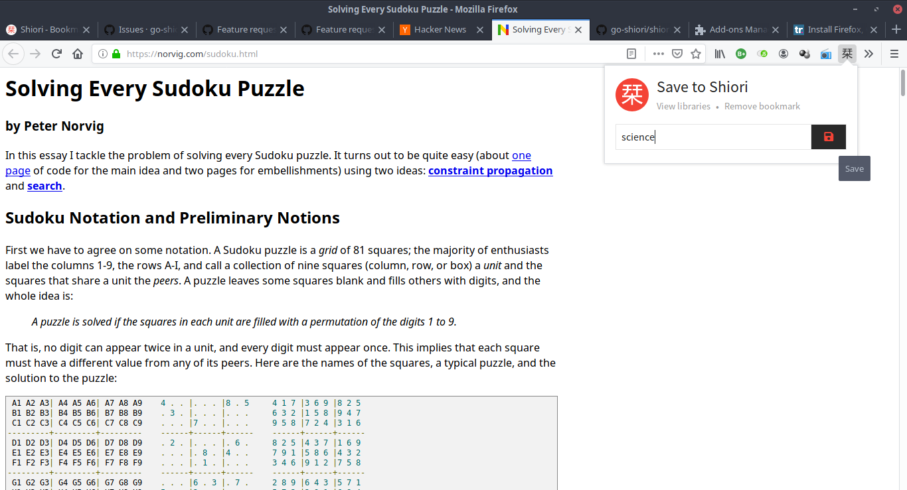

# Shiori Web Extension

Shiori Web Extension is a simple extension for managing bookmarks using Shiori. This extension is intended to integrate Shiori with your favorite web browser. This way, you can save and remove bookmarks in Shiori without switching from your current page.

## Versioning

This project now follows the same versioning system that Shiori uses, that means that starting on `v1.6.0` the extension will match the supported version of the server. This is to avoid confusion and to make it easier to know which version of the extension is compatible with your server.

Different releases for the same server version will be appended as the extension version, for example, `v1.6.0.1` is the first release of the extension for Shiori `v1.6.0`.

## Development Status

This extension is still in beta, however it's already usable at this point. Unfortunately, I've only tested it in Firefox 59+ so there is no guarantee that it will work in another browser.

## Installation

Download the extension from release page then install it in your favorite browser.

## Initial Setup

Before using the web extension, we need to specify the server, username and password to access our Shiori instance. To do so, you can specify it in extension options page.

In Firefox, open add-ons page (`about:addons`) then choose Shiori Web Extension :

Next click `Preferences` tab then specify server, username and password :

Once finished, click login button. If all goes well, it will show the currently active session and the extension is ready to use.

## License

Shiori Web Extension is distributed using [MIT license](https://choosealicense.com/licenses/mit/), which means you can use and modify it however you want. However, if you make an enhancement for it, if possible, please send a pull request. If you like this project, please consider donating to me either via [PayPal](https://www.paypal.me/RadhiFadlillah) or [Ko-Fi](https://ko-fi.com/radhifadlillah).
